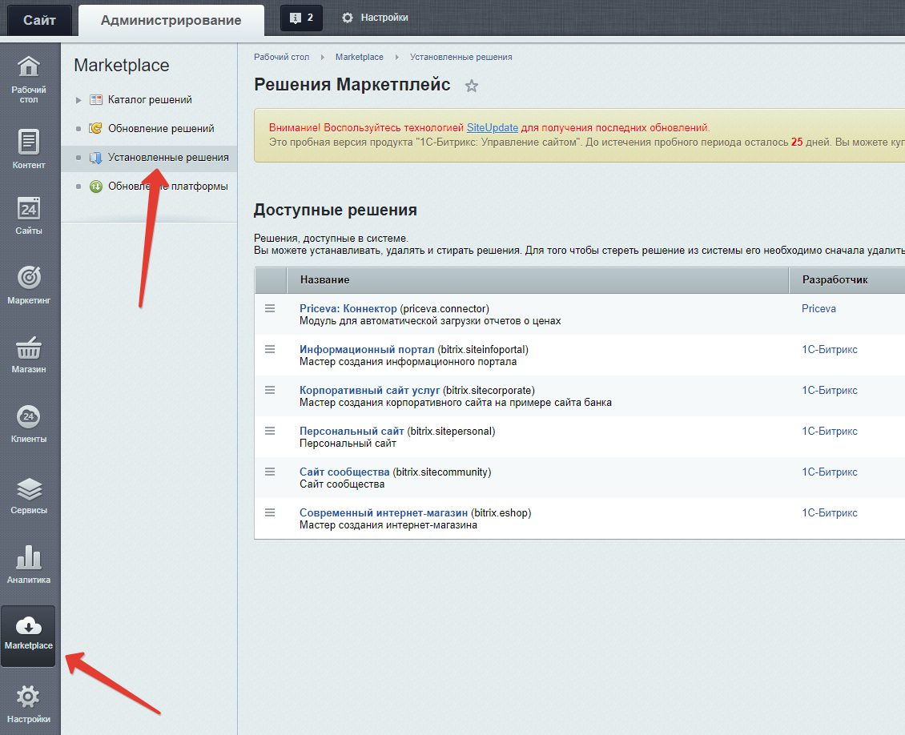
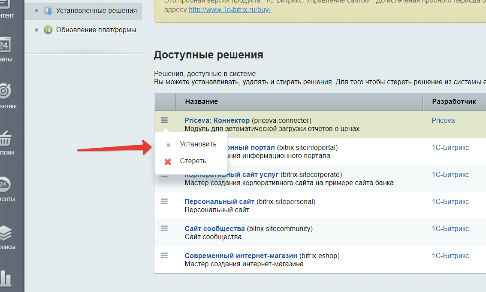

# Интеграция сервиса мониторинга цен конкурентов Priceva и CMS 1С-Битрикс 

## Установка из архива

1. Скайчате актуальный релиз [со страницы релизов](https://github.com/priceva/priceva-1c-bitrix/releases).
2. Подключитесь к своему хостингу и создайте в папке вашего сайта на одном уровне с папкой `bitrix` папку `local`, а в ней папку `modules`, если их еще не было. В последней папке создайте папку `priceva.connector`. Сохранять именно такое название обязательно.
3. Перенесите в созданную папку файлы и папки из скачанного вами архива. В итоге у вас должна получиться вот такая структура директорий:

    ````
    ...
    ├── bitrix
    ...
    ├── index.php
    ├── local
    │   └── modules
    │       └── priceva.connector
    │           └── admin
    ...
    ```
    
4. Зайдите в админку Битрикс по адресу `http://ваш-сайт.домен/login/`, после чего откройте в меню слева `Администрирование / Marketplace / Установленные решения` и найдите в списке модулей `Priceva: Коннектор`.

    

5. Щелкните на "гамбургере" слева от имени модуля и выберите `Установить`. Следуйте инструкциям инстяллатора.

    

## Установка из Маркетплейса

Появится позднее.
